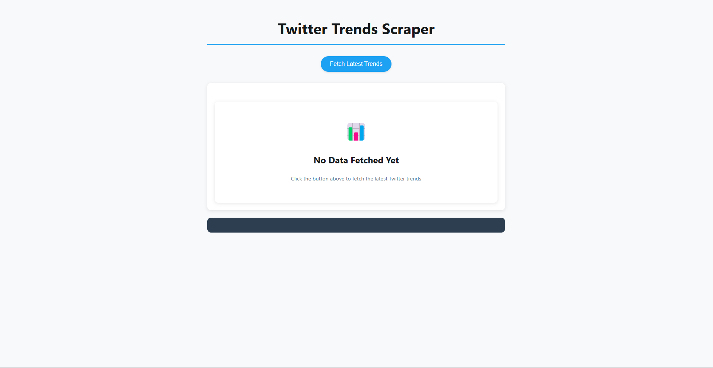
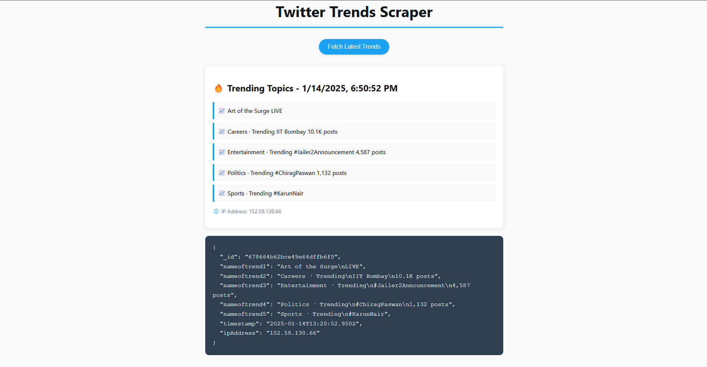

# Twitter Trends Scraper


## Overview
The **Twitter Trends Scraper** is a Node.js-powered web application that scrapes Twitter’s trending topics and stores the data in a MongoDB database. It also features a visually appealing frontend for users to fetch and view the latest trends directly from a browser.

## Key Features
- **Scraping Twitter Trends:** Utilizes Selenium WebDriver to scrape trending topics from Twitter.
- **Proxy Support:** Configured with ProxyMesh for IP rotation.
- **MongoDB Integration:** Stores scraped data in a MongoDB database.
- **Interactive Frontend:** Fetches trends and displays them in a responsive and stylish web interface.
- **Error Handling:** Handles scraping failures gracefully and uses default fallback data when needed.

## Directory Structure
```
x-trends
├── node_modules        # Dependencies
├── public
│   └── index.html      # Frontend HTML file
├── .gitignore          # Ignored files
├── package.json        # Node.js dependencies and scripts
├── package-lock.json   # Locked dependency tree
├── scraper-debug.log   # Debugging logs for scraper
├── scraper.js          # Scraper logic using Selenium
├── server.js           # Express server logic
```

## Technologies Used
- **Backend:** Node.js, Express.js
- **Web Scraping:** Selenium WebDriver, ChromeDriver
- **Database:** MongoDB Atlas
- **Frontend:** HTML, CSS, JavaScript
- **Proxy Management:** ProxyMesh

## Setup Instructions

### Prerequisites
1. Install [Node.js](https://nodejs.org/).
2. Install [MongoDB](https://www.mongodb.com/) or set up a MongoDB Atlas cluster.
3. Download [ChromeDriver](https://chromedriver.chromium.org/downloads) and add it to your system path.

### Steps to Run
1. **Clone the repository:**
   ```bash
   git clone [https://github.com/your-username/twitter-trends-scraper.git](https://github.com/immo7932/TrendSpyder)
   cd twitter-trends-scraper
   ```

2. **Install dependencies:**
   ```bash
   npm install
   ```

3. **Configure environment variables:**
   Update the following constants in `scraper.js` and `server.js`:
   - `X_USERNAME`: Your Twitter username.
   - `X_PASSWORD`: Your Twitter password.
   - `MONGO_URI`: MongoDB connection string.

4. **Run the server:**
   ```bash
   node server.js
   ```

5. **Access the application:**
   Open your browser and go to [http://localhost:3000](http://localhost:3000).

## How It Works
1. **Scraping Logic:**
   - Uses Selenium WebDriver to log into Twitter and scrape the "Trending Now" section.
   - Stores scraped data in a MongoDB database for easy access and persistence.

2. **Frontend:**
   - Users can fetch the latest trends by clicking a button.
   - Results are displayed dynamically on the page with stylish animations.

3. **Error Handling:**
   - If scraping fails, default trends are used, and errors are logged in `scraper-debug.log`.

## Screenshots
### Homepage

)

### Scraped Trends


## API Endpoints
- **POST `/run_scraper`**
  - Triggers the scraper and stores the data in MongoDB.
  - **Response:** JSON object with scraped trends, timestamp, and IP address.

## Known Issues
- Twitter’s dynamic login flows may require additional handling for captchas or 2FA.
- Ensure ProxyMesh credentials are valid to avoid proxy-related errors.

## Future Enhancements
- Add support for scraping trends by region or language.
- Implement automatic captcha solving.
- Deploy the application to a cloud platform like AWS or Heroku.

## Contributing
Feel free to fork this repository, raise issues, or submit pull requests to contribute to the project.

---
**Happy Scraping!** 🚀
